- Общие сведения
	+ Направление
	+ Транзитивность 
	+ Типы
	+ Обработка запросов на аутентификацию в рамках доверительных отношений между доменами
		* Kerberos
		* NTLM
	+ Обработка запросов на аутентификацию в рамках доверительных отношений между лесами доменов
	+ Объект доверенного домена (TDO)
- Поддержка доверительных отношений с samba 
- Процесс настройки доверительных отношений с использованием samba
	+  Samba DC и Windows Server с AD
		*  Windows Server с AD
		*  Samba DC с BIND9_DLZ
	+  Два домена Samba
		*  Настройка DNS
		*  Создание двустороннего транзитивного подключения
- Управление пользователями и группами
	+ Список пользователей и групп
	+ Тестирование аутентификации
	+ ..
	+ ..
- Использование трастов на Linux-клиентах
	+ Winbind
	+ SSSD
- Удаление доверия

## Общие сведения
Элементы сети, такие как пользователи, компьютеры и устройства, могут быть организованы в иерархическую логическую структуру, состоящую из нескольких уровней:

+ **домен** — логическое объединение пользователей, компьютеров, принтеров и других объектов, использующих общую базу данных для управления ресурсами и доступом;

+ **дерево доменов** — иерархическая структура, состоящая из одного или нескольких доменов, объединённых общим корневым доменом, которая формирует единое пространство DNS-имен и использует общие схему и глобальный каталог;

+ **лес доменов** — одно или несколько деревьев доменов, которые используют общую схему и глобальный каталог.

Между элементами сети устанавливаются доверительные отношения с помощью механизмов аутентификации и авторизации, чтобы обеспечить безопасный доступ к ресурсам.

**Доверительное отношение** — связь между двумя доменами, позволяющая пользователям и объектам одного домена получать доступ к ресурсам другого домена.

**Доверяющий домен** - предоставляет доступ к своим ресурсам пользователям из другого домена, доверяя ему процесс аутентификации;

В доверяющем домене A вы можете получить доступ к пользователям и группам из доверенного домена Б. Пользователи и доменные группы из домена Б могут использоваться администратором домена A для предоставления этим пользователям и группам разрешений на доступ к ресурсам в домене А. Если доверие является односторонним, администратор домена A должен пройти проверку подлинности со своими учётными данными в домене Б. Это означает, что администратор домена Б должен настроить учётную запись для администратора из домена А. Эта учётная запись будет использоваться администратором из домена A для аутентификации в домене Б, чтобы получить доступ к пользователи и группам из домена Б.

**Доверенный домен** - выполняет аутентификацию своих пользователей при запросе ими доступа к ресурсам в другом домене.

Пользователи и доменные группы из доверенного домена Б могут использоваться доверяющим доменом А. Пользователи домена Б не увидят ни одного пользователя из домена A, если доверие является односторонним. Пользователи из домена A не смогут получить доступ к каким-либо ресурсам из домена Б.

Доверительное отношение имеет следующие свойства:

+ направление;

+ транзитивность;

+ Тип (область действия).

### Направление 

Направление доверительного отношения определяет, как осуществляется аутентификация между двумя доменами:

- Одностороннее доверительное отношение:
	+ Входящее: один из связанных доменов имеет возможность аутентифицировать пользователей из другого домена. Например, если установлено одностороннее входящее доверительное отношение между доменами A и B, домен A может аутентифицировать пользователей из домена B, но домен B не может аутентифицировать пользователей из домена A.
	
	+ Исходящее: один из связанных доменов может аутентифицировать пользователей своего домена в другом домене. При одностороннем исходящем доверительном отношении между доменами A и B, домен B может аутентифицировать своих пользователей в домене A, но не наоборот.
	
- Двустороннее доверительное отношение означает, что оба связанных домена могут аутентифицировать пользователей друг друга. То есть если между доменами А и Б установлено двустороннее доверительное отношение, домен А может аутентифицировать пользователей из домена Б, и домен Б может аутентифицировать пользователей из домена А.

### Транзитивность

**Транзитивное доверие** используется для расширения доверительных отношений на другие связанные домены.

**Нетранзитивное доверие** используется для запрета доверительных отношений с другими доменами.

+ если между доменами А и Б установлено транзитивное доверительное отношение, а домены Б и В также связаны транзитивным доверием, то между доменами А и В возникает неявное транзитивное доверие.

+ если же между доменами А и Б установлено нетранзитивное доверительное отношение, и домены Б и В связаны либо нетранзитивным, либо транзитивным доверием, то между доменами А и В не возникает никакого доверительного отношения, будь то транзитивное или нетранзитивное.

### Типы
+ **Внешнее доверительное отношение (External Trust)**

Это нетранзитивное доверительное отношение, которое может быть как односторонним, так и двусторонним. Создается напрямую между двумя доменами, один из которых находится вне текущего леса (в другом лесу).

+ **Лес доменов (Forest Trust)**

Это транзитивное доверительное отношение, которое может быть как односторонним, так и двусторонним. Создается при необходимости  установить транзитивное доверие между двумя лесами доменов для обмена данными и доступом между всеми доменами в этих лесах.

+ **Домен — область безопасности (Realm)**

Этот тип доверительных отношений может быть как односторонним, так и двусторонним, а также транзитивным или нетранзитивным, в зависимости от требований к безопасности и доступу. Обеспечивает аутентификацию между доменом Windows Active Directory и областью безопасности Kerberos, которая может быть основана на другой операционной системе (например, Linux).

+ **Сокращённое доверительное отношение (Shortcut Trust)**

Это нетранзитивное доверительное отношение, которое может быть как односторонним, так и двусторонним. Используется для оптимизации аутентификации между двумя доменами внутри одного леса. Обычно оно создается между доменами, которые находятся на большом удалении друг от друга в иерархии дерева доменов, чтобы сократить время аутентификации.

- **Родитель — потомок (Parent-Child)**

Это транзитивное двустороннее отношение, которое создается при добавлении нового домена в существующее дерево доменов.

- **Корень дерева доменов — корень дерева доменов (Tree-Root)**

Это транзитивное двустороннее отношение, которое создается при добавлении в лес нового дерева доменов.

### Обработка запросов на аутентификацию в рамках доверительных отношений между доменами

Если запрос на проверку подлинности пересылается в домен, контроллер домена в этом домене должен определить:

+ наличие доверительного отношения с доменом, из которого поступил запрос;

+ направление доверительного отношения;

+ транзитивность доверительного отношения.

Процесс аутентификации между доменами, связанными доверительными отношениями, зависит от используемого протокола — Kerberos версии 5 или NTLM.

#### Протокол Kerberos

Протокол Kerberos использует доверительные отношения для обеспечения взаимодействия между службами выдачи билетов (TGS) в разных областях безопасности и для валидации сертификатов безопасности (PAC) по защищенному каналу.

При использовании клиентом Kerberos для аутентификации билет для доступа к серверу в целевом домене запрашивается у контроллера домена в собственном домене. Подлинность обеих сторон устанавливается с помощью сессионного ключа, который предоставляет служба распределения ключей Kerberos (KDC) выступая в качестве доверенного посредника между клиентом и сервером.

Если указанный в запросе на аутентификацию целевой домен отличается от текущего домена клиента, KDC выполняет следующие действия для определения возможности перенаправления запроса:

Является ли текущий домен доверенным для домена, где находится сервер, к которому адресован запрос:

+ Да - KDC переадресует клиента на запрошенный домен;

+ Нет - KDC переходит к следующему шагу.

Существует ли между текущим доменом и следующим доменом на пути к целевому серверу транзитивное доверительное отношение:

+ Да - клиент перенаправляется на следующий домен по цепочке доверия на пути к целевому серверу;

+ Нет - KDC возвращает клиенту сообщение о невозможности получения доступа к запрошенному целевому серверу.

#### Протокол NTLM
Для клиентов, которые не поддерживают аутентификацию с помощью протокола Kerberos применяется протокол NTLM. Для передачи междоменных запросов на аутентификацию он использует доверительные отношения

Если клиент инициирует запрос на аутентификацию для получения доступа к серверу с ресурсами в удаленном домене по протоколу NTLM, запрос перенаправляется напрямую на целевой сервер. Целевой сервер формирует запрос (challenge), на который отвечает клиент. Сервер отправляет ответ клиента на контроллер в своем домене. Контроллер домена проверяет подлинность учетной записи, которая указана в запросе, по имеющейся у него базе данных.

Если учетная запись в базе данных отсутствует, контроллер домена принимает решение о предоставлении доступа с помощью механизма сквозной (pass-through) аутентификации, отказе в доступе или необходимости переадресовать запрос, используя следующий алгоритм:

Существует ли явное доверительное отношение между текущим доменом и доменом, в котором находится клиент:

+ Да - контроллер домена отправляет реквизиты доступа клиента на контроллер в домене, в котором находится клиент, для выполнения сквозной аутентификации;

+ Нет - контроллер домена переходит к следующем шагу.

Существует ли транзитивное доверительное отношение между текущим доменом и доменом, в котором находится клиент:

+ Да - запрос на аутентификацию передается в следующий домен по цепочке доверия, который также проверяет реквизиты доступа пользователя по своей базе данных учетных записей;

+ Нет - клиенту возвращается сообщение об отказе в доступе к запрошенному серверу.

### Обработка запросов на аутентификацию в рамках доверительных отношений между лесами доменов

При наличии доверительного отношения между двумя лесами доменов они могут обмениваться запросами на аутентификацию для доступа к имеющимся в них ресурсам по протоколам Kerberos и NTLM.

В процессе установки доверительного отношения каждый лес собирает информацию обо всех доверенных пространствах имен в другом лесе и сохраняет ее в виде объекта доверенного домена (trusted domain object, TDO). Доверенные пространства имен включают в себя имена деревьев доменов, суффиксы UPN-имен (user principal name), суффиксы SPN-имен (service principal name) и пространства идентификаторов безопасности (SID) в другом лесу. Объекты доверенных доменов реплицируются в глобальный каталог.

Чтобы протоколы аутентификации могли использовать доверительное отношение между лесами для обработки запроса, SPN-имя компьютера с запрашиваемым ресурсом должно разрешаться внутри другого леса.

В качестве SPN может выступать одно из следующих имен:

+ DNS-имя хоста;

+ DNS-имя домена;

+ DN-имя объекта, выступающего в качестве точки подключения сервиса.

Когда рабочая станция в одном лесу пытается получить доступ к данным на компьютере с ресурсами в другом лесу, процесс аутентификации Kerberos запрашивает у контроллера домена сервисный билет для SPN компьютера, на котором находится целевой ресурс. Если при выполнении запроса к глобальному каталогу контроллер домена определяет, что SPN находится не в том же лесу, к которому относится контроллер домена, он отправляет рабочей станции ссылку на свой родительский домен. Рабочая станция обращается к указанному в ссылке родительскому домену с запросом сервисного билета и продолжает двигаться по цепочке таких ссылок, пока не достигнет домена, в котором находится целевой ресурс.

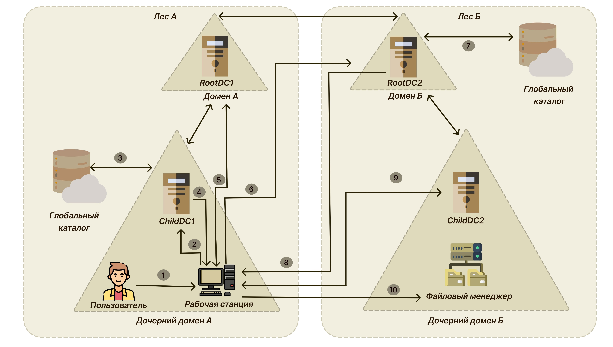

Этапы процесса:

1. Пользователь выполняет вход на рабочую станцию, используя свои реквизиты доступа для дочернего домена А в лесу А. Затем пользователь запрашивает доступ к общему ресурсу на файловом сервере, работающем в дочернем домене Б в лесу Б.

2. Рабочая станция обращается по протоколу Kerberos к KDC на контроллере домена ChildDC1 и запрашивает сервисный билет для SPN файлового сервера.

3. Контроллер домена ChildDC1 не находит SPN файлового сервера в своей базе данных и обращается к глобальному каталогу, чтобы узнать, содержится ли данное SPN-имя в каком-либо из доменов в лесу А. Поскольку глобальный каталог ограничен пределами леса А, запрошенное SPN-имя в нем отсутствует.

Не найдя SPN, глобальный каталог проверяет по своей базе данных наличие у леса А доверительных отношений с другими лесами. Если доверительные отношения существуют, суффиксы имен, перечисленные в соответствующих объектах доверенного домена (TDO), сопоставляются с суффиксом целевого SPN. В случае совпадения глобальный каталог возвращает необходимую для маршрутизации запроса информацию контроллеру домена ChildDC1.

С помощью этой информации запрос на аутентификацию может быть перенаправлен в целевой лес. Она используется только в тех случаях, когда все традиционные каналы аутентификации, включая локальный контроллер домена и глобальный каталог, не могут найти требуемое SPN-имя.

4. Контроллер домена ChildDC1 возвращает рабочей станции ссылку на свой родительский контроллер домена.

5. Рабочая станция обращается к корневому контроллеру домена леса ForestRootDC1 в родительском домене с запросом на получение ссылки на контроллер домена (ForestRootDC2) в корневом домене леса Б. ForestRootDC1 возвращает ссылку.

6. Рабочая станция обращается к ForestRootDC2 в лесу Б с запросом билета для доступа к требуемому сервису (файловый сервер).

7. Корневой контроллер домена леса Б ForestRootDC2 запрашивает в глобальном каталоге своего леса требуемое SPN-имя. Глобальный каталог находит совпадение и возвращает его ForestRootDC2.

8. ForestRootDC2 отправляет рабочей станции в домене А ссылку на дочерний домен Б.

9. Рабочая станция выполняет запрос к KDC на контроллере дочернего домена Б ChildDC2 для получения билета на доступ к файловому серверу для пользователя.

10. После получения сервисного билета рабочая станция отправляет его файловому серверу, который запрашивает реквизиты доступа пользователя и формирует токен доступа в соответствии с ними.

### Объект доверенного домена (TDO)
Для каждого доверительного отношения между доменами и лесами создается объект доверенного домена (TDO), который хранится в контейнере System в каталоге.

Состав информации в TDO зависит от типа доверительного отношения.

Для доверительного отношения между доменами он содержит такие атрибуты, как DNS-имя домена, SID домена, тип доверия, признак транзитивности и имя домена, являющегося второй стороной в рамках доверительного отношения.

Объект TDO для доверительного отношения между лесами дополнительно хранит атрибуты, позволяющие идентифицировать все доверенные пространства имен во втором домене. В число этих атрибутов входят имена деревьев доменов, суффиксы UPN-имен, суффиксы SPN-имен и пространств идентификаторов безопасности (SID).

Благодаря тому что доверительные отношения хранятся в виде объектов TDO, всем доменам в лесу доступна информация о доверительных отношениях во всем лесу. Также при установлении доверительных отношений между лесами корневым доменам в каждом лесу доступна информация о доверительных отношениях между всеми доменами в доверенных лесах.

## Поддержка доверительных отношений с Samba

**Поддерживается:**

+ Доверие в лесу доменов — как двустороннее доверие так и транзитивное доверие. Это доверие может быть установленным между двумя Samba-доменами или Samba-доменом и Windows-доменом.
+ Внешние доверительные отношения между доменом AD и доменом в стиле NT.
+  Добавление пользователей и групп доверенного домена в группы доверяющего домена, но при этом необходимо использовать SID пользователей и групп, чтобы добавить их в свою группу (имя пользователя или имя группы использовать невозможно).
+ В RSAT появится контейнер ForeignSecurityPrincipal для всех добавленных пользователей и групп из доверенного домена. Таким образом Microsoft показывает, что пользователь или группа являются частью доверенного домена.

**Особенности и ограничения:**

+ для входа в доверенный домен через SSSD надо использовать тип связи External, а не Forest;
+ не применяются правила фильтрации SID;
+ Обе стороны траста должны полностью доверять друг другу. Это означает, что администратор из домена A может управлять всеми объектами в домене Б и наоборот;
+ Выборочная аутентификация в настоящий момент не поддерживается. Возможно создание таких доверий, но KDC и winbindd всё равно будут их игнорировать;
+ Нельзя создать доверительные отношения между доменами в одном дереве с одним и тем же пространством имён верхнего уровня. NetBIOS имена доменов должны отличаться (домен MYDOMAIN.WIN и MYDOMAIN.NEW будут иметь одинаковое короткое имя — MYDOMAIN, это приведет к невозможности установки доверительных отношений);
+ Winbind на клиентских машинах не распознаёт доверенные домены, что приводит к проблемам с обновлением паролей учетных записей доверенного домена после их истечения. Чтобы устранить эту проблему, необходимо внести изменения в конфигурационный файл smb.conf на Linux-клиентах, подключенных через Winbind. В секции [global] этого файла следует добавить соответствующую опцию:

	  winbind scan trusted domains = yes

Перезапустить сервис winbind:

	#systemctl restart winbind.service

Для управления доверием можно использовать инструмент командной строки **samba-tool**.
⁠
| Команда                       | Описание                                      | Примечание                                                                                                                                                                                                                                                                                                                                                                                                                                                                     |
|-------------------------------|-----------------------------------------------|--------------------------------------------------------------------------------------------------------------------------------------------------------------------------------------------------------------------------------------------------------------------------------------------------------------------------------------------------------------------------------------------------------------------------------------------------------------------------------|
| domain trust create <домен>   | Создать доверие домена или леса               | Можно использовать следующие опции:  --type=TYPE — тип доверия (external,forest);   --direction=DIRECTION — направление доверия (incoming,outgoing,both);  --create-location=LOCATION  — где создать объект доверенного домена (local,both);  --quarantined=yes\|no — применять к доверию специальные правила фильтрации SID  (при --type=external по умолчанию yes,  при --type=forest по умолчанию no);  -U USERNAME — имя пользователя. |
| domain trust modify <домен>   | Изменить доверие домена или леса              |                                                                                                                                                                                                                                                                                                                                                                                                                                                                                |
| domain trust delete <домен>   | Удалить доверие домена или леса               | Можно использовать следующие опции:  --delete-location=LOCATION  — где удалить объект доверенного домена (local, both);  -U USERNAME — имя пользователя.                                                                                                                                                                                                                                                                                                           |
| domain trust list             | Вывести список доверительных отношений домена |                                                                                                                                                                                                                                                                                                                                                                                                                                                                                |
| domain trust show <домен>     | Показать сведения о доверенном домене         |                                                                                                                                                                                                                                                                                                                                                                                                                                                                                |
| domain trust validate <домен> | Проверить доверие к домену                    | Можно использовать следующие опции:  --validate-location=LOCATION — где проверить объект доверенного домена ( local, both);  -U USERNAME — имя пользователя.                                                                                                                                                                                                                                                                                                    |

## Процесс настройки доверительных отношений с использованием Samba

### Samba DC и Windows Server с AD

Установка доверительных отношений между Windows 2012R2 и SambaDC

> Внимание! Для входа в доверенный домен через SSSD надо использовать тип связи external, а не forest.

+ Домен Windows:

 	Имя домена - WIN.DOM
 	
 	Контроллер домена - DC2.WIN.DOM
 	
 	IP address - 10.64.224.116
 	
 	ОС контроллера домена - Windows Server 2012R2
 	
	 Уровень работы домена - 2012R2
	 
+ Домен Linux:

  Имя домена - TEST.ALT
 
  Контроллер домена - DC1.TEST.ALT
 
  IP address - 10.64.224.108
 
  ОС контроллера домена - Alt Server 10.2
 
  Уровень работы домена - 2012_R2
 
  Версия Samba - 4.19.7
___

### Windows Server с AD

+ **Настройка DNS**

На AD сервере создать сервер условной пересылки для зоны Samba домена.

**В графическом интерфейсе:**

1. Открыть Диспетчер DNS (DNS Manager).
2. В разделе Серверы условной пересылки (Conditional Forwarders) добавить новый сервер пересылки, указав FQDN или IP-адрес сервера Samba:

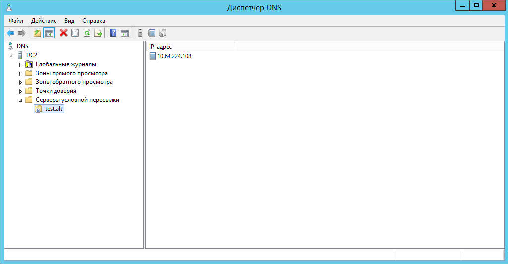

3. Сохранить настройки.

**В командной строке:**

	PS$ Add-DnsServerConditionalForwarderZone -Name lin.loc -MasterServers 172.16.100.135 -ReplicationScope Forest

+ **Создание двухстороннего транзитивного подключения:**

В домене win.dom открываем «Диспетчер серверов», и выбираем «Средства» — «Active Directory — Домены и Доверие»:

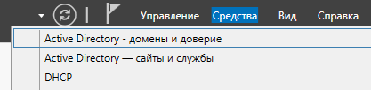

В открывшемся окне в контекстном меню домена WIN.DOM необходимо выбрать «Свойства». Откроется окно свойств, в котором нужно перейти во вкладку «Отношения доверия» и нажать на «Создать отношение доверия»:

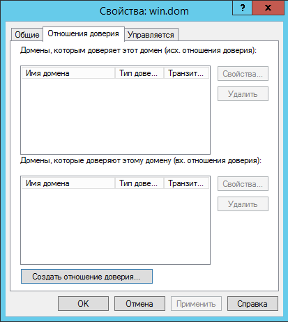

В открывшемся мастере создания отношения доверия вводим имя домена Samba DC. В данном случае TEST.ALT:

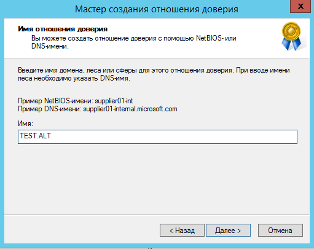

На следующей вкладке «Тип доверия» выбираем «Доверие леса»:

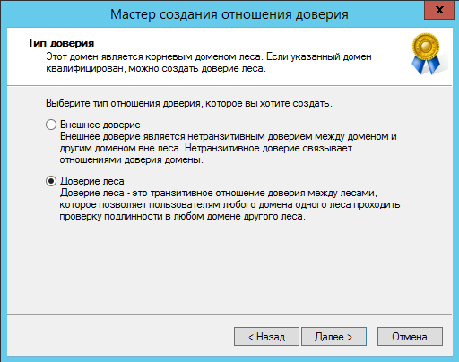

Далее во кладке «Направление отношения доверия» выбираем «Двухстороннее»:

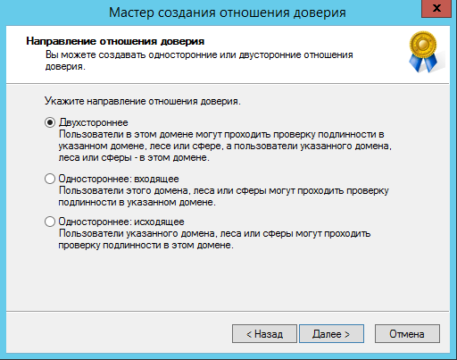

В открывшемся окне «Стороны отношения доверия» необходимо выбрать, на каком из доменов будет применена настройка. В нашем случае у нас есть права администратора для обоих доменов, поэтому выбираем пункт «Для данного и указанного домена».

Если был выбран параметр «Только для данного домена», то необходимо будет задать Trust Secret Key, который в дальнейшем будет использоваться при создании доверительного отношения на стороне Samba DC.

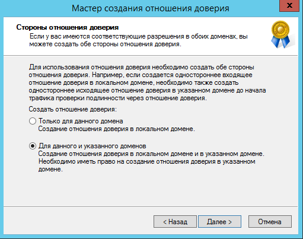

На следующем этапе мастер свяжется с доменом TEST.ALT (если он доступен), и запросит логин и пароль от пользователя с правами установки доверительных отношений в домене TEST.ALT:

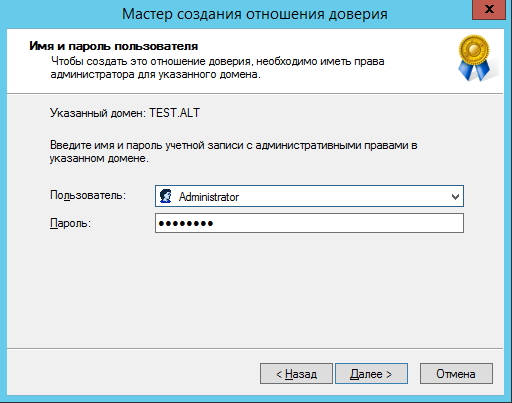

Далее на вкладке «Уровень проверки подлинности исходящего доверия — Локальный лес» выбираем «Проверка подлинности в лесу»:

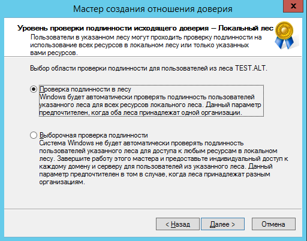

Тоже самое выбираем и на следующей вкладке «Уровень проверки подлинности исходящего доверия — Указанный лес».

После очередного нажатия на кнопку «Далее» мастер в окне «Выбор доверия завершен» выдаст уведомление о том, что готов создать новое отношение доверия, и покажет краткую сводку по выбранным параметрам. Соглашаемся с параметрами, после чего должно появиться уведомление о том, что создание доверия успешно завершено:

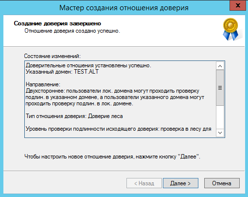

После нажатия на «Далее» появится окно «Подтверждение исходящего доверия», а после него «Подтверждение входящего отношения доверия». Здесь и в первом и во втором окне оставляем «Нет, не подтверждаю это исходящее/входящее отношение доверие», так как на стороне Samba DC доверие нами еще не создавалось:

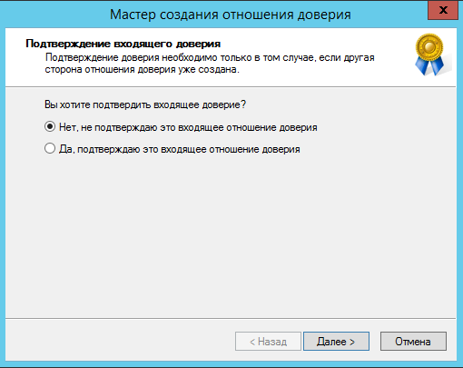

Отношение доверия успешно создано:

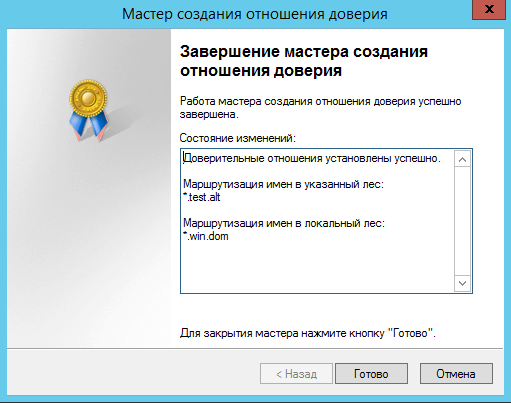

Проверку можно осуществить в свойствах домена WIN.DOM во вкладке «Отношения доверия».

: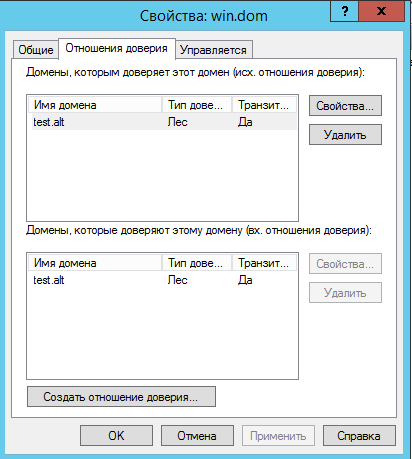

Необходимо выбрать домен, который вы хотите проверить и нажать «Свойства»:

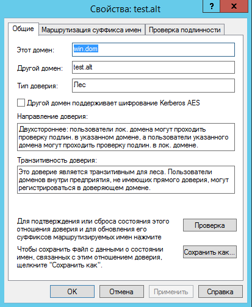

Для подтверждения или сброса состояния этого отношениядоверия и для обновления его суффиксов маршрутизируемых имен необходимо нажать «Проверка»:

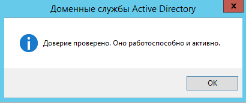

### Samba DC с BIND9_DLZ
+ **Настройка DNS**
1. Создать сервер условной перессылки для службы DNS. При использовании DNS бэкенда BIND9_DLZ добавить в конец файла /etc/bind/options.conf (или /etc/bind/ddns.conf) строки:

	  	zone "win.dom" in {
	  		type forward;
   			forwarders { 10.64.224.116; };
  		};

Подробнее про настройку домена можно прочесть в [документации ALT Linux Team](https://docs.altlinux.org/ru-RU/archive/9.0/html/alt-server/)

И перезапустить службу DNS:

	# systemctl restart bind.service

2. Проверяем возможность получения билета Kerberos в домене WIN.DOM:

		# kinit Администратор@WIN.DOM
		# klist
		Ticket cache: FILE:/tmp/krb5cc_500
		Default principal: Администратор@WIN.DOM

		Valid starting       Expires              Service principal
		09.09.2024 15:49:11  10.09.2024 01:49:11  krbtgt/WIN.DOM@WIN.DOM
			renew until 10.09.2024 15:49:01

> Если удалённый DNS-сервер не использует DNSSEC и включить проверку DNSSEC на удаленном DNS-сервере нельзя, можно отключить проверку DNSSEC на сервере AD. Для этого необходимо в файл /etc/bind/options.conf в секцию options добавить параметр:

	 dnssec-validation no;

>  И перезапустить службу DNS:

	# systemctl restart bind.service

+ **Создание двухстороннего транзитивного подключения:**

На контроллере домена dc1.test.alt:

	# samba-tool domain trust create win.dom --type=forest --direction=both --create-location=both -Uадминистратор@WIN.DOM

> Для входа в доверенный домен через SSSD надо использовать тип связи external, а не forest.